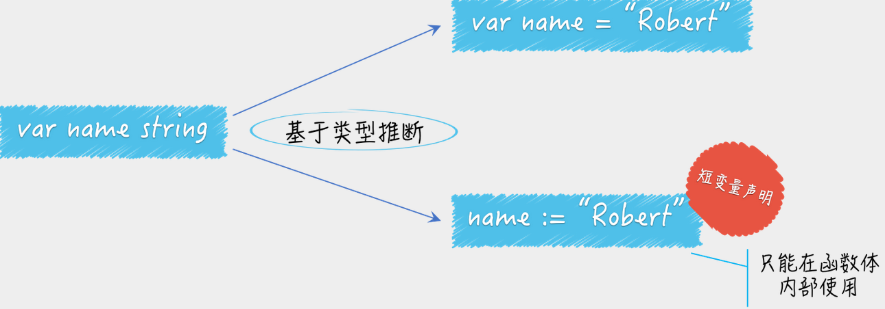

# Variable & Constant

## Variable
### 声明
- 标准声明
```go
var name string 
name = "XXX"
```

- 合并声明：采用了Go的类型判断
```go
var name = "XXX"
```

- 短变量声明：采用了Go的类型判断，但只能在函数体内使用短变量声明
```go
name := "XXX"
```



### 作用域
一个程序实体的作用域总是会被限制在某个代码块中，而作用域最大的用处就是对程序实体的访问权限的控制。

- 代码引用变量总会最优先查找当前代码块中的那个变量
- 如果当前代码块中没有，那么会沿着代码块的嵌套关系一层层地向上查找，一直查到当前代码包代码块
- 如果仍然找不到，那么 Go 语言的编译器就会报错了

### 类型断言 表达式
- `x.(T)`：x代表要被判断类型的值，T带包判断类型
- `T(x)`：类型转换表达式

```go
value, ok := interface{}(container).([]string)
```
- 把container变量的值转换为空接口值的interface{}(container)
- 判断前者的类型是否为切片类型 []string 的 .([]string)

## Constant


