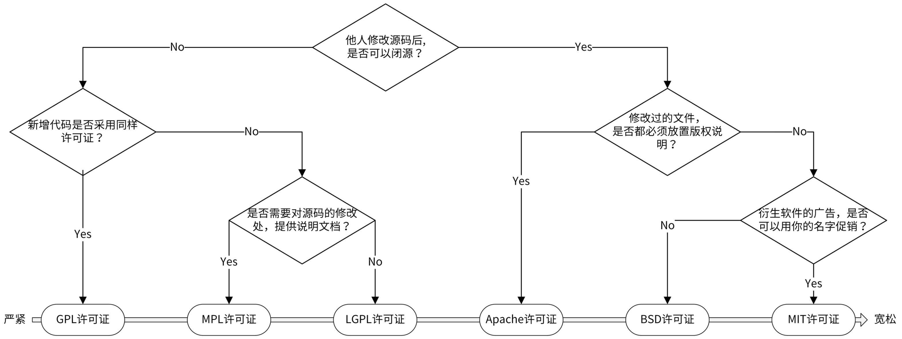

# 版本声明

## 开源规范

开源规范主要有两方面优势：

- 开源项目在代码质量、代码规范、文档等方面，要比非开源项目要求更高，在项目开发中按照开源项目的要求来规范自己的项目，可以更好地驱动项目质量的提高；
- 一些大公司为了不重复造轮子，会要求公司团队能够将自己的项目开源，所以提前按开源规范来驱动 Go 项目开发，也会为日后代码开源省去不少麻烦。

### 开源协议

一个开源项目一定需要一个开源协议，开源协议规定了在使用开源软件时的权利和责任，也就是规定了可以做什么，不可以做什么。所以，开源规范的第一条规范就是选择一个合适的开源协议。

### 具体规范

- 项目结构：一个开源项目应该有一个合理、专业的、符合语言特色的项目结构。
- 严格遵循代码规范：开源的代码，面向的人群是所有的开发者，一个不规范的代码，可读性差，不利于其他开发者阅读和贡献代码。
- 代码质量：开源的代码，一定要保证代码的质量，一个低质量的代码，不仅隐藏了很多性能和功能缺陷，而且还会影响开源项目的品牌，进而影响开源效果。
- 单元测试覆盖率：一个开源的 Go 项目，要保证整个项目的单元测试覆盖率，这样一方面可以保证代码的质量，另一方面可以使开源项目更专业，也能让你更加安心的发布版本。
- 版本发布规范：开源项目要遵循既定的版本规范，整个项目的更新迭代，要有版本号，目前用的比较多的是语义化的版本规范。
- 向下兼容：代码要做到向下兼容，这样可以尽可能减少发布变更的影响，遵循语义化的版本规范，可以在一定程度上保证代码的向下兼容能力。
- 详细的文档说明：要保证代码能够被其他开发者很容易的阅读和贡献代码，所以不仅要保证文档的质量和数量，还要确保有某些需要的文档：
  - LICENSE（如果是开源项目，LICENSE 是必选的）：软件协议，声明该开源项目遵循什么软件协议。
  - README.md：README 文件，放在项目的根目录下，包含项目的描述、依赖项、安装方法、使用方法、贡献方法、作者和遵循的软件协议等。
  - CHANGELOG：目录，用来存放版本的变更历史，方便其他开发者了解新版本或旧版本的变更内容。
  - Makefile：对于一个复杂的项目，通常也会包含一个 Makefile 文件，用来对项目进行构建、测试、安装等操作。
  - CONTRIBUTING.md：用来说明如何给本项目贡献代码，包含贡献流程和流程中每个环节的详细操作。
  - docs：目录，用来存放本项目所有文档，例如：安装文档、使用文档、开发文档等。一些重要的文档，可以链接到项目根目录的 README.md 文档中。这些文档要确保开发者能够轻松的理解、部署和使用该项目。
  - examples：存放一些示例代码。
- 安全：开源的代码，要保证整个代码库和提交记录中，不能出现类似内部 IP、内部域名、密码、密钥这类信息。
- 完善的 examples：完善的 examples，可以帮助用户快速学习和使用开源项目。
- 好的 Commit Message 记录：开源项目在 commit 时，要遵循一定的规范，这样其他开发者才能够快速浏览和理解变更历史，减小学习成本，本项目遵循 Angular commit message 规范。
- 发布可用的版本：要确保每一次发布都经过充分的测试，每一个发布的版本都是可用的。
- 持续的更新：一个好的开源项目，应该能够持续的更新功能，修复 Bug。对于一些已经结项、不维护的开源项目，需要及时的对项目进行归档，并在项目描述中加以说明。
- 及时的处理 pull request、issue、评论等：当项目被别的开发者提交 pull request、issue、评论时，要及时的处理，一方面可以确保项目不断被更新，另一方面也可以激发其他开发者贡献代码的积极性。
- 建立讨论小组：如果条件允许，最好和贡献者建立讨论小组，每周或每月组织讨论，共同维护。
- 做好推广：如果有条件，可以宣传运营开源项目，让更多的人知道，更多的人用，更多的人贡献代码。例如：在掘金、简书等平台发表文章，创建 QQ、微信交流群等。
- Git 工作流：选择合适的 Git 工作流，并遵循 GIt 工作流使用规范，例如 Gitflow 工作流。

