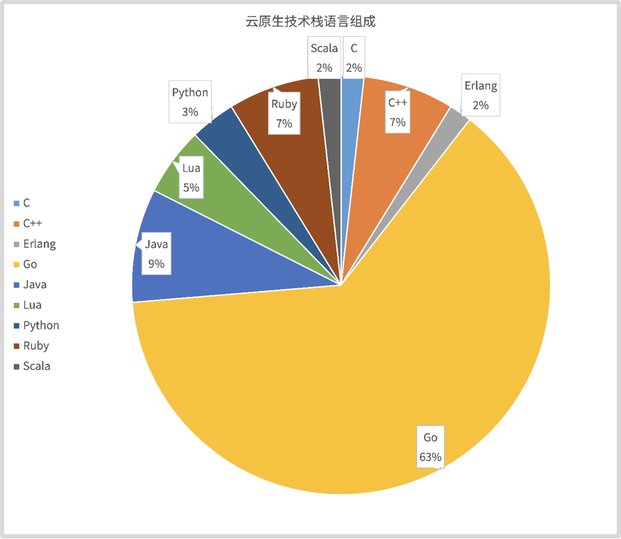

# Go 云原生实践

## 简介

Go 是一门非常优秀的语言，它具有很多核心优势，例如：语言简单、语言层面支持并发编程、跨平台编译、自带垃圾回收机制等。同时，随着云计算平台的逐渐成熟，应用上云已经成为一个不可逆转的趋势，很多公司都选择将基础架构、业务架构云化，而云原生架构中具有统治力（影响力）的项目绝大部分又是用 Go 构建的。因此，实现基础架构、业务架构云化，离不开对这些云原生开源项目的学习、改造。

 

提示 完整的云原生技术栈可参考云原生技术图谱：https://landscape.cncf.io/images/landscape.png。

### 学习方式

本项目通过 Go 应用开发及云上部署，详细介绍了云上应用的开发、部署等最佳实践。详细讲解实际开发过程中涉及的知识点和技能点，彻底学会如何构建企业级 Go 项目，并解决 Go 项目开发所面临的各类问题。通过本项目可以俯瞰整个 Go 企业应用的开发流程，不仅能知道一个优秀的企业应用涉及的技能点和开发工作，还能知道如何高效地完成每个阶段的开发工作。同时，能够深入每个技能点，掌握它们的具体构建方法、业界的最佳实践和一线开发经验。

除了带来项目开发知识和宝贵的经验之外，本项目最终会交付一套成熟的、可运行的 Go 应用代码。这套代码能够适用于绝大多数的 web service 应用开发场景，可以基于它做二次开发，快速构建自己的应用。

本项目共分为 7 部分。其中，第一部分是 Go 环境的准备，第 2 到第 7 部分详细介绍如下：

## Installation

- [Installation](01_installation/README.md)：Go 语言环境安装。

## Basics

- [Basics](10_basics/README.md)：Go 编程语言基础知识。

## Lib

- [Lib](30_lib/README.md)：Go 基本库介绍。

## Web

- [Web](50_web/README.md)：Go web service 开发介绍。

## PaaS

- [PaaS](60_paas/README.md)：Go 应用用到的常见 PaaS。

## Standards

- [Standards](80_standards/README.md)：介绍开发中常见的规范，例如目录规范、日志规范、错误码规范、Commit 规范等。通过项目设计部分，学会如何设计常见的规范，进而为高效开发一个高质量、易阅读、易维护的 Go 应用打好基础。

## Software Engineering

- [Software Engineering](84_se/README.md)：讲解如何管理IAM项目，包括静态代码检查、Makefile 编写、生成 API 文档和开发流程实战。具体包括如何进行单元测试、功能测试、性能分析和性能调优。通过测试，最终会交付一个性能和稳定性都经过充分测试的、生产级可用的应用。在部署部分会重点介绍 2 种部署方式：基于虚拟机的部署方式和容器化的部署方式，每种方式在部署方法、复杂度和能力上都有所不同。
